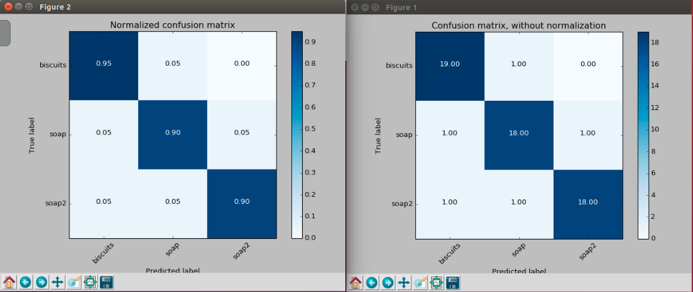
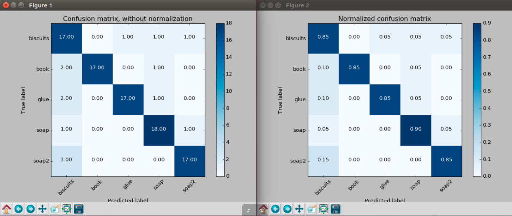
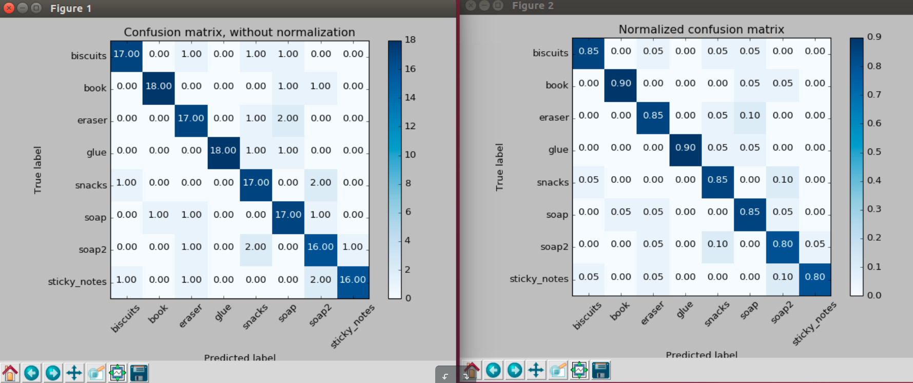

# Project: 3D Perception

### Writeup by Tuan Le
### June 2018

# 1/ Project overview
This project will utilise several image filtering and machine learning algorithms to train a robot to recognise objects in 3D space. This process devide into two main sub-process. Firstly, objects are captured by RGBD camera and put through an image processing pipeline. Secondly, these images will be used to train a robot with SVM algorithm. Thirdly, after training with SVM algorithm, models of trainning objects will be saved and used in online object detection process. Finally, the robot will be programmed to calculate each object's centroid and store into yaml files. These yaml files will be used later for pick-and-place task. 

In this project, I only concentrate on developing the image processing pipeline to segment and detect objects, then, calculate objects's centroids and output yaml files. pick-and-place task was not fully implemented.

# 2/ The Perception Pipeline

## Exercise 1
## 2.a - Stastical Outlier Filtering
### Description
Due to noise in an image signal, the image need to be filtered. A tool is used was Stastical Outlier Filtering. This filter will eliminate any point which is considered to be noise in a point cloud cluster.

in this stage, for each point in the point cloud cluster, a mean distance between a point and its neighbours is calculated. By using a Gaussian distribution, all point which have mean distance are exceed an interval limited by the global distances mean+standard deviation are outlier, thus, removed from the cluster.

### Code
```python
    # Creating a filter object:
    outlier_filter = pointCloud.make_statistical_outlier_filter()
    # The number of neighboring points to be analyzed
    outlier_filter.set_mean_k(3)
    # Set standard deviation threshold scale factor
    x = 0.00001
    outlier_filter.set_std_dev_mul_thresh(x)
    cloud_filtered = outlier_filter.filter()
    # Storing a new point cloud image into noise_filtered
    noise_filter = cloud_filtered
```
I found **K-mean of 3** and **Threshold Scale Factor of 0.00001** are the most suitable value to eliminate noise. With these values, the cluster only take three of its neighbors into its cluster with all points who have a distance smaller than or equal to 0.00001 standard deviation of the mean distance.

### Picture
Below is the result of my filter.

<p align="center">  </p>

## 2.b - Voxel Grid Downsampling
### Description
**Voxel Grid Downsampling** stage reduces an amount of sample in the Point Cloud objects but it still allow the objects are represented as a whole. The purpose of this Voxel Grid Dowmsampling filter is to reduce exceed samples which contribute to cost in calculation, memory and time.

In this filter, the **LEAF_SIZE** parameter determines the resolution and the number of sample of a Point Cloud cluster. For my code, I chose **LEAF_SIZE = 0.01** (0.01 meters). My method is trial and error to find a suitable value. 0.01 is a reasonable value that display the objects in whole and has right amount of sample.

### Code
My code is shown as below:
```python
    # Downsampling the PointCloud
    vox = cloud_filtered.make_voxel_grid_filter()
    # Choosing LEAF_SIZE
    LEAF_SIZE = 0.01
    vox.set_leaf_size(LEAF_SIZE, LEAF_SIZE, LEAF_SIZE)
    cloud_filtered = vox.filter()
    # Storing a new point cloud image into downsample_filter
    downsample_filter = cloud_filtered
```

### Picture
Here is result image of my Point Cloud clusters.
<p align="center">  </p>

## 2.c - PassThrough Filter
### Description
This filter acts as a dropping tool in three-dimension space. Point Cloud image will be dropped according to three axises, x-axis, y-axis, and z-axis. In order to have a clear image for segmentation process in the next stage, I have choose to drop in two axises, **y-axis and z-axis**. Dropping in y-axis to eliminate two edges of the green and red boxes.

### Code
```python
    # PassThrough Filter implementation
    # Filter along the z-axis
    passthrough = cloud_filtered.make_passthrough_filter()
    filter_axis = 'z'
    passthrough.set_filter_field_name(filter_axis)
    axis_min = 0.6 # Lower limit of the height
    axis_max = 1.1 # Upper limit of the height
    passthrough.set_filter_limits(axis_min, axis_max)
    cloud_filtered = passthrough.filter()

    # Filter along the y-axis
    passthrough = cloud_filtered.make_passthrough_filter()
    filter_axis = 'y'
    passthrough.set_filter_field_name(filter_axis)
    axis_min = -0.5 # Far left of the table
    axis_max = 0.5 # Far right of the table
    passthrough.set_filter_limits(axis_min, axis_max)
    cloud_filtered = passthrough.filter()
    # Apply filters
    Passthrough_filter = cloud_filtered
```
After experimenting with various value, the **axis_min** and **axis_max** in z-axis are 0.6 and 1.1 respectively. In the y-axis, the **axis_min** and **axis_max** are -0.5 and 0.5 respectively. The result of the filter is shown in the picture below.

### Picture
<p align="center">  </p>

## 2.d - RANSAC Plane Segmentation
### Description
Next in the perception pipeline, we need to separate the table and the objects. To achieve this goal, a popular technique known as Random Sample Consensus or "RANSAC". RANSAC is an algorithm that identifies points in the dataset to belong to a specific model. Mathematic models chosen in this case are a box, a cylinder and other common shape. Because the table in the scene is the single most prominent plane, RANSAC can be used effectively to identify points belong to the table. The table will be then consider as an **inlier** and the objects are **outliers**.

### RANSAC Code
```python
    # RANSAC Plane Segmentation
    seg = cloud_filtered.make_segmenter()
    # Setting a mathematic model of a plane to fit the table's shape
    seg.set_model_type(pcl.SACMODEL_PLANE)
    # Setting method of filter as the RANSAC segmentation
    seg.set_method_type(pcl.SAC_RANSAC)
    # Maximum distance between a point and its neighbors
    max_distance = 0.01
    seg.set_distance_threshold(max_distance)

    inliers, coefficients = seg.segment()
```
### Inliers and Outliers Extraction Code
```python
    # Extracting the table
    cloud_table = cloud_filtered.extract(inliers, negative=False)
    # Extracting the objects
    cloud_objects = cloud_filtered.extract(inliers, negative=True)
```

### Picture
#### Image of the objects:
<p align="center">  </p>

#### Image of the table:
<p align="center">  </p>

## Exercise 2
## 2.e - Euclidean Clustering
### Description
The last step in filtering is to use Eulidean Clustering algorithm to group points into individual objects from the **cloud_objects**. Euclidean Clustering will group all points which are satisfied three parameters (Cluster Tolerance, Minimum Cluster Size, and Maximum Cluster Size). Euclidean Clustering is also known as DBSCAN clustering.

**Cluster Tolerance** is a radius of a point that is being assessed. In this case, I chose 0.03 meters after testing with different values.

**Minimum Cluster Size** is the minimum number of data points that a cluster needs to become a cluster. 10 points are enough to form a cluster.

**Maximum Cluster Size** is the maximum number of data points that a cluster needs and does not exceed. 9000 points are approximately enough so that the cluster will not contain noise or intersect with other cluster.

After finishing the Euclidean Clustering, we need to assign color to each cluster to identify different objects.

### Code
#### **Euclidean clustering**
```python
    white_cloud = XYZRGB_to_XYZ(cloud_objects)
    tree = white_cloud.make_kdtree()
    ec = white_cloud.make_EuclideanClusterExtraction()
    ec.set_ClusterTolerance(0.05) # Default: 0.001
    ec.set_MinClusterSize(10) # Default: 10
    ec.set_MaxClusterSize(2000) # Default: 250
    ec.set_SearchMethod(tree)
    cluster_indices = ec.Extract()
```
#### **Cluster_Mask Point Cloud for visualization**
```python
    cluster_color = get_color_list(len(cluster_indices))
    color_cluster_point_list = []
    # Loop through all points in a cluster and assign a color
    for j, indices in enumerate(cluster_indices):
      for i, indice in enumerate(indices):
          color_cluster_point_list.append([white_cloud[indice][0],
                                          white_cloud[indice][1],
                                          white_cloud[indice][2],
                                          rgb_to_float(cluster_color[j])])
    cluster_cloud = pcl.PointCloud_PointXYZRGB()
    cluster_cloud.from_list(color_cluster_point_list)
```

### Picture
<p align="center">  </p>

## 2.g - Converting PointCloud data to ROS messages and publish
### Description
Finally, each Point Cloud filtered data in each stage are converted into ROS messages to be publish to ROS topic.

### Code
```python
    # Converting PCL to ROS messages
    ros_noise_filter = pcl_to_ros(noise_filter)
    ros_downsample_filter = pcl_to_ros(downsample_filter)
    ros_passthrough_filter = pcl_to_ros(Passthrough_filter)
    ros_cloud_objects = pcl_to_ros(cloud_objects)
    ros_cloud_table =  pcl_to_ros(cloud_table)
    ros_cluster_cloud = pcl_to_ros(cluster_cloud)
    # Publish to ROS topic
    pcl_noise_pub.publish(ros_noise_filter)
    pcl_downsample_pub.publish(ros_downsample_filter)
    pcl_passthrough_pub.publish(ros_passthrough_filter)
    pcl_objects_pub.publish(ros_cloud_objects)
    pcl_table_pub.publish(ros_cloud_table)
    pcl_cluster_pub.publish(ros_cluster_cloud)
```
# 3/ Object Recognition

## Exercise 3
## 3.a - Color Histogram and Normal Histogram

### Color Histogram
The color histogram technique is one of the common way to analyse color of a image/object. Each object has a set of color list range from 0 to 256 (if the object is a 32 bit image). The color histogram loop through each pixel and store pixel color into bins. These bins contain the number of pixel which has the same color value.

In this **compute_color_histograms** function, a selected bin size is 32 and color range is from 0 to 256.

```Python
def compute_color_histograms(cloud, using_hsv=False): # Default: False
    # Compute histograms for the clusters
    point_colors_list = []
    # Step through each point in the point cloud
    for point in pc2.read_points(cloud, skip_nans=True):
        rgb_list = float_to_rgb(point[3])
        if using_hsv:
            point_colors_list.append(rgb_to_hsv(rgb_list) * 255)
        else:
            point_colors_list.append(rgb_list)
    # Populate lists with color values
    channel_1_vals = []
    channel_2_vals = []
    channel_3_vals = []

    for color in point_colors_list:
        channel_1_vals.append(color[0])
        channel_2_vals.append(color[1])
        channel_3_vals.append(color[2])

    # TODO: Compute histograms
    R_hist = np.histogram(channel_1_vals, bins = 32, range = (0, 256))
    G_hist = np.histogram(channel_2_vals, bins = 32, range = (0, 256))
    B_hist = np.histogram(channel_3_vals, bins = 32, range = (0, 256))

    # TODO: Concatenate and normalize the histograms
    hist_features = np.concatenate((R_hist[0], G_hist[0], B_hist[0])).astype(np.float64)
    # Generate random features for demo mode.
    # Replace normed_features with your feature vector
    normed_features = hist_features / np.sum(hist_features)
    return normed_features
```

### Normal Histogram

```Python
def compute_normal_histograms(normal_cloud):
    norm_x_vals = []
    norm_y_vals = []
    norm_z_vals = []

    for norm_component in pc2.read_points(normal_cloud,
                                          field_names = ('normal_x', 'normal_y', 'normal_z'),
                                          skip_nans=True):
        norm_x_vals.append(norm_component[0])
        norm_y_vals.append(norm_component[1])
        norm_z_vals.append(norm_component[2])

    # TODO: Compute histograms of normal values (just like with color)
    Nor_x_hist = np.histogram(norm_x_vals, bins = 32, range = (0, 256))
    Nor_y_hist = np.histogram(norm_y_vals, bins = 32, range = (0, 256))
    Nor_z_hist = np.histogram(norm_z_vals, bins = 32, range = (0, 256))
    # TODO: Concatenate and normalize the histograms
    hist_features = np.concatenate((Nor_x_hist[0], Nor_y_hist[0], Nor_z_hist[0])).astype(np.float64)
    # Generate random features for demo mode.
    # Replace normed_features with your feature vector
    normed_features = hist_features / np.sum(hist_features)

    return normed_features
```

## 3.b - Features Capturing
Before the robot in this project can recognise an object, it need to learn about that object. The learning here is just purely learn about features of an objects. In order to achieve this, all the objects are presented in front of a camera in different angles.

According to this project, I have trained the robot with three lists of objects. Here are the lists.

**+ List 1:** 'biscuits', 'soap', 'soap2'

**+ List 2:** 'biscuits', 'soap', 'book', 'soap2', 'glue'

**+ List 3:** 'sticky_notes', 'book', 'snacks', 'biscuits', 'eraser', 'soap', 'soap2', 'glue'

In **feature_capture.py**, I change the attempt number to **20** so the robot can capture more features. Thus, allow the SVM training stage to be more accurated.

```Python
# Disable gravity and delete the ground plane
initial_setup()
labeled_features = []

for model_name in models:
    spawn_model(model_name)

    for i in range(20): # Default: 5
        # make 20 attempts to get a valid a point cloud then give up
        sample_was_good = False
        try_count = 0
        while not sample_was_good and try_count < 20: # With 20 attempts, the robot can capture more.
            sample_cloud = capture_sample()
            sample_cloud_arr = ros_to_pcl(sample_cloud).to_array()

            # Check for invalid clouds.
            if sample_cloud_arr.shape[0] == 0:
                print('Invalid cloud detected')
                try_count += 1
            else:
                sample_was_good = True

        # Extract histogram features
        chists = compute_color_histograms(sample_cloud, using_hsv=True)
        normals = get_normals(sample_cloud)
        nhists = compute_normal_histograms(normals)
        feature = np.concatenate((chists, nhists))
        labeled_features.append([feature, model_name])

    delete_model()


pickle.dump(labeled_features, open('training_set.sav', 'wb'))
```
## 3.c - SVM Training
SVM is stand for (Support Vector Machine). SVM is an machine learning algorithm which is used to segment data points into clusters. The segmentation will be depend on **kernel function**.

In this project, I used the **linear kernel function** to avoid overfitting. Here is my code in __train_pvm.py__

```Python
# Create classifier
clf = svm.SVC(kernel='linear') # default: linear
```
Here is my **Confusion Matrix** and **Normalized Confusion Matrix**.

#### Confusion Matrix of Pick List 1 (Accuracy Score of 0.917)

| Test 1 Parameters| Values |
|-|-|
| Features in Training Set | **60** |
| Invalid Features in Training Set | **0** |
| Scores | **[0.9167 0.9167 0.9167 0.8333 1.000]** |
| Accuracy | **0.92 (+/- 0.11)** |
| Accuracy Score | **0.9167** |
<p align="center">  </p>

#### Confusion Matrix of Pick List 2 (Accuracy Score of 0.86)

| Test 2 Parameters| Values |
|-|-|
| Features in Training Set | **100** |
| Invalid Features in Training Set | **0** |
| Scores | **[1.000 0.800 0.800 0.850 0.850]** |
| Accuracy | **0.86 (+/- 0.15)** |
| Accuracy Score | **0.860** |
<p align="center">  </p>

#### Confusion Matrix of Pick List 3 (Accuracy Score of 0.85)

| Test 3 Parameters| Values |
|-|-|
| Features in Training Set | **160** |
| Invalid Features in Training Set | **0** |
| Scores | **[0.874 0.781 0.844 0.813 0.938]** |
| Accuracy | **0.85 (+/- 0.11)** |
| Accuracy Score | **0.85** |
<p align="center">  </p>

## 3.d - Objects Detection
This is the third exercise part in the pcl_callback() function where the cluster of objects is classified.

After going through the filtering and clustering process in the previous section, the robot is trained to recognize the objects with SVM algorithm. The next stage is the objects detection. The robot will detect all the objects in front of it and classify them according to the predetermined pick list.

The process is simple and is summarized as follow.
1. Extracting the list of point cloud and store to * **pcl_cluster** *.
2. Converting from pcl data (* **pcl_cluster** *) to ROS data (* **ros_cluster** *).
3. Extracting histogram features from * **ros_cluster** *.
4. Making prediction and label each objects. Then store all in * **detected_objects_labels** *.
5. Publishing the labels list into RViz.
6. Adding the detected objects into * **detected_objects** *

Before go to the object prediction, create two lists of **detected_objects_labels** and **detected_objects**.

```Python
# Classify the clusters! (loop through each detected cluster one at a time)
   detected_objects_labels = []
   detected_objects = []
```
#### 1. Extracting the list of point cloud and store to * **pcl_cluster** *.
```Python
   for index, pts_list in enumerate(cluster_indices):
      # Grab the points for the cluster
      pcl_cluster = cloud_objects.extract(pts_list)
```
#### 2. Converting from pcl data (* **pcl_cluster** *) to ROS data (* **ros_cluster** *).
```Python
      # Compute the associated feature vector
      # Convert the cluster from pcl to ROS using helper function
      ros_cluster = pcl_to_ros(pcl_cluster)
```
#### 3. Extracting histogram features from * **ros_cluster** *.
```Python
      # Extract histogram features
      chists = compute_color_histograms(ros_cluster, using_hsv=True)
      normals = get_normals(ros_cluster)
      nhists = compute_normal_histograms(normals)
      feature = np.concatenate((chists, nhists))
```
#### 4. Making prediction and label each objects. Then store all in * **detected_objects_labels** *.
```Python
      # Make the prediction
      # Retrieve the label for the result and add it to detected_objects_labels list
      prediction = clf.predict(scaler.transform(feature.reshape(1,-1)))
      label = encoder.inverse_transform(prediction)[0]
      detected_objects_labels.append(label)
```
#### 5. Publishing the labels list into RViz.
```Python
      # Publish a label into RViz
      label_pos = list(white_cloud[pts_list[0]])
      label_pos[2] += .4
      object_markers_pub.publish(make_label(label,label_pos, index))
```
#### 6. Adding the detected objects into * **detected_objects** *
```Python
      # Add the detected object to the list of detected objects.
      do = DetectedObject()
      do.label = label
      do.cloud = ros_cluster
      detected_objects.append(do)

   rospy.loginfo('Detected {} objects: {}'.format(len(detected_objects_labels), detected_objects_labels))
   # Publish the list of detected objects

```
Follwing images showing the objects with names:

#### Pick List 1 (100% Accuracy)
<p align="center">  </p>

#### Pick List 2 (100% Accuracy)
<p align="center">  </p>

#### Pick List 3 (100% Accuracy)
<p align="center">  </p>

#### PR2_mover Function
Last part of the **pcl_callback()** function is to invoke the **pr2_mover()** function to pick and place the detected objects.

```Python
detected_objects_pub.publish(detected_objects)
try:
    pr2_mover(detected_objects)
except rospy.ROSInterruptException:
    pass
```

# 4/ Pick and Place Setup
## Pick and Place Request
### Description
Pick and Place request is implemented with **pr2_mover()** function. Pick and Place process is divided into two main sub-stages. Firstly, the object's centroid is calculated and outputed into yaml files. Secondly, a pick-and-place request will is instructed by using data from the yaml files to execute the pick-and-place task. In this project, I only implemented a code to output yaml files. Below is a summary of my code sequence.

1. Initialize variables
2. Read parameters from ROS parameters server
3. Obtain objects' Centroids
4. Produce information to be assigned to Pick-and-Place task
5. Output yaml files

### Code
#### Initialize Variables and Set the Test Scene.
```Python
# function to load parameters and request PickPlace service
def pr2_mover(object_list):

    # TODO: Initialize variables to their appropriate ROS message type.
    yaml_dict_list = []
    test_scene_num = Int32()
    arm_name = String()
    object_name = String()
    pick_pose = Pose()
    place_pose = Pose()

    # Set test scene number according to the selected test
    test_scene_num.data = 1
```
#### Read Parameter from ROS Parameter Server
In this part, there are other two parts, Parsing Parameters and PR2 Rotation. Because I do not intend to implement the pick-and-place request, Parsing Parameters and PR2 Rotation were not filled.
```Python
    # TODO: Get/Read parameters
    object_list_param = rospy.get_param('/object_list')
    # TODO: Parse parameters into individual variables
    # TODO: Rotate PR2 in place to capture side tables for the collision map
```
#### Obtain Objects' Centroids

```Python
    # Calculate objects' centroids
    labels = []
    centroids = [] # to be list of tuples (x, y, z)
    for obj in object_list:
	     labels.append(obj.label)
	     points_arr = ros_to_pcl(obj.cloud).to_array()
	     centroids.append(np.mean(points_arr, axis=0)[:3])
```
#### Information to be assigned in Pick and Place task
The code loops through **object_list_param** to create a place pose and assign an arm to execute the pick-and-place task. All of these information/parameters will be stored into a yaml dictionary which is associated with the **test_scence_num**.

```Python
    # TODO: Loop through the pick list
    for i in range(0, len(object_list_param)):
          # TODO: Get the PointCloud for a given object and obtain it's centroid
	         object_name.data = object_list_param[i]['name']
	         object_group = object_list_param[i]['group']
	         n = labels.index(object_name.data)

          # TODO: Create 'place_pose' for the object
	         pick_pose.position.x = np.asscalar(centroids[n][0])
	         pick_pose.position.y = np.asscalar(centroids[n][1])
	         pick_pose.position.z = np.asscalar(centroids[n][2])

          # TODO: Assign the arm to be used for pick_place
	         if object_group == 'red':
		          arm_name.data = 'left'
	         elif object_group == 'green':
		          arm_name.data = 'right'

          # TODO: Create a list of dictionaries (made with make_yaml_dict()) for later output to yaml format
	         yaml_dict = make_yaml_dict(test_scene_num, arm_name, object_name, pick_pose, place_pose)
	         yaml_dict_list.append(yaml_dict)
```
#### Output Yaml Files
Final step is to output all parameters into an associated yaml file.
```Python
    # TODO: Output your request parameters into output yaml file
    yaml_filename = 'output_' + str(test_scene_num.data) + '.yaml'
    send_to_yaml(yaml_filename, yaml_dict_list)
```
## Output Yaml Files
[**output_1.yaml**](./src/pr2_robot/config/output_1.yaml)

[**output_2.yaml**](./src/pr2_robot/config/output_2.yaml)

[**output_3.yaml**](./src/pr2_robot/config/output_3.yaml)

# 5/ Discussion and Future Improvements
The perception pipeline results show good outcomes and can segment all the objects. The values of each stage were chosen approximately and randomly through trial-and-error method. Even though the results are satisfied, the values are not optimal. Therefore, a method is needed to obtain the optimal values.

One aspect need to be improved is the feature capturing process. The feature capturing process depends on two ways which are not enough. A situation, where both methods (color histogram and normal histogram) will fail, is trying to capture features of two objects with the similar size, shape and colors. To solve this problem, we can use point cloud data after segmentation to add into capture featuring data because point cloud data with color is easy to distinguish.  

